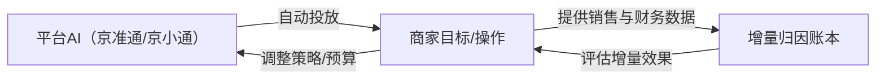

# 京东投流AI反馈调研报告

**执行摘要：** 调研显示，京东广告投放AI整体功能持续升级，但商家反馈喜忧参半（见表）。京准通智能投放（原“京速推”）集成了智能定向、智能出价、智能创意等功能（特征层面为A级），京小通和京麦进一步引入对话式AI经营助手与智能投放保障方案（如“稳赚计划”100%投产比保障）（政策层面为B级）。官方案例表明，使用全站营销等AI工具可提升GMV（如优质商品GMV环比增长258%），但独立学术与商家案例也指出归因与增量效果难以评估（归因争议为C级）。商家评论普遍提到数据延迟、操作不便、SKU定向不足等痛点（C级），同时希望更细粒度控制和透明的投放效果报告。礼品店场景下，由于定制化、咨询型购买需求高等特点，单纯依赖平台AI的投放效果不稳定，需要结合场景词与人工优化。调研建议的30天验证实验方案包括A/B测试平台默认投放与AI辅助投放的ROI和增量利润对比、归因账本效果评估、以及礼品场景下场景词对比等，以数据驱动验证AI辅助投放的实际价值。

## 1. 京东投流AI产品功能及政策现状

- **京准通智能投放（京速推）**：平台主推的智能投放产品，结合京东广告的智能定向、智能出价、智能创意等技术能力，覆盖搜索、推荐等多渠道流量（A）。商家只需设置广告目标和预算，AI可自动匹配人群和创意，满足投放诉求。京准通还提供API和图形界面进行账户和广告管理。
- **京小通AI智能体**：2026年初发布的对话式AI营销助手，将海量营销数据与大模型结合，为商家提供从策略洞察、创意生成、智能投放到诊断优化的全链路AI方案（B）。京小通宣传称可“秒级生成高质量广告创意与视觉素材，融合跨账号经营数据，并自动完成归因分析”（B）。测试阶段声称京造投放提效30%（B）。
- **京麦AI经营空间/商智**：京麦工作台推出“AI经营空间”，自动分析店铺经营、给出优化建议，并自动维护商品素材（B）。618期间，京麦与京智深化整合全域数据与智能投放：商家仅设预算和ROI目标，AI在商智中自动生成策略并对接京准通（B）。京准通“稳赚计划”则对符合条件的商品提供**100%投产比保障**（目标ROI未达成由平台赔付）（B）。**（证据：京东官方政策和媒体报道）**

表1：京东投流平台功能与商家反馈（示例）  

| 平台/工具    | 核心功能         | 商家反馈（优点/问题）                | 证据等级 |
|-------------|------------------|------------------------------------|---------|
| 京准通智能投放（京速推） | 智能定向/出价/创意，覆盖搜索推荐 | **优点：**自动化程度高，上手简单。**问题：**数据延迟、功能不够灵活；**SKU定向受限**（仅SPU投放）；后台操作复杂。 | A/B/C    |
| 京小通        | 自然语言交互AI助手，创意秒生、跨账号归因 | **优点：**全链路AI运营，一站式方案；**问题：**仍处于推广早期，商家接纳度未知，更多为锦上添花。 | B        |
| 商智/京麦AI全站营销 | 全站流量整合投放，设ROI即自动投放；“稳赚计划”100%ROI保障 | **优点：**操作极简，提升中小商家GMV（试点商品GMV涨258%）；**问题：**如ROI目标设定错误，成本控制不佳；归因透明度不够。 | B        |

## 2. 官方案例与媒体报道

- **智能投放效率提升：** 2024年亿邦动力报道，京准通“全站营销”产品上线半年试点，优质商品使用该产品后GMV环比增长258%（B）。媒体称全站营销“将自然流量和广告流量打通，以全站ROI为目标，极简操作帮商家实现全站托管”。不同品牌（如美的、联合利华）报道投放效果提升，618大促中首次大规模检验该工具。
- **AI创意与归因：** 媒体报道京小通阶段测试提到可以快速生成广告创意和素材，支持跨账号分析、自动归因（B）。这些功能理论上缓解了商家素材制作和效果分析的负担。
- **政策保障：** 春晓计划等官方资源中强调AI+补贴。例如2026年京东618期间，“京麦商智”接入稳赚计划保障：商家可筛选满足条件商品参与，享受平台**100%投产比保障机制**（B）。若广告目标ROI未达成，平台按未达部分赔付。此举表明平台为帮助商家降风险，增强信心。

## 3. 商家真实反馈与痛点

- **数据延迟与稳定性（C级）：** 商家常在评论和论坛抱怨“京准通后台数据卡顿、延迟严重”“活动期间数据滞后或不上报，影响决策”（C）。App Store 用户评论中，有商家提到非大促期间“数据卡住两个小时不动，折扣修改功能不稳定”。这反映出对实时监测的高需求与现有系统不足。
- **操作体验与控制权（C级）：** 部分商家反映京准通界面复杂，移动端功能不完善，甚至评价“见过的最垃圾的商业软件”（C）。同时，多位商家提问为何**仅支持SPU级投放**、无法指定SKU投放，以及后台操作需跳转多个页面（C）。自主调价、分组出价等精细控制能力不足，是显著痛点。
- **归因与增量难辨（B/C级）：** 平台会给出广告带来成交额，但商家关心“增量GMV是多少，是否只是自然单转化”（B/C）。学术界指出电商平台广告花费与总销售关系复杂，无增量思维的归因模型容易误导。京东宣传的MTA模型虽先进，但独立评估仍是挑战。商家希望更透明的归因报告，区分广告和自然带来的订单，这直接影响ROI判断。
- **素材与人效（B/C级）：** AI辅助创意虽获好评，但部分商家认为实际使用体验待观察。商家指出还需人力优化细节（如创意语调、目标人群圈定）。对于礼品类商品，商家强调**场景化关键词（如“员工福利”、“伴手礼”）**更贴合目标客群，但平台AI自动生成通用词难完全覆盖所有场景。

## 4. 礼品店场景的特殊影响

礼品店常面向个人送礼和企业采购两类市场，购买流程更重**咨询与定制**。礼品店商品往往需要**开票、定制包装、大批量供货**等服务，这超出了AI投放系统单一下单的模式。礼品店投放投入往往以**引流咨询**为主而非直接交易，因此简单的点击转化率低。其特殊影响包括：

- **场景需求多样：** 礼品店需要针对“节日礼盒”“商务礼品”“伴手礼”等场景做营销，使用通用关键词难以触达精准人群。商家需要专门的**场景词包**来命中送礼意图，平台AI默认的人群和词库不足以覆盖所有场景需求。
- **长决策链路：** 企业采购决策需要审批和评估，往往在广告曝光后先留线索，再由销售跟进成交，单纯投放难追踪效果。商家很难只通过平台统计看到完整效果。
- **复购与品牌：** 礼品店客户粘性高（如节庆全年复购），投资重点在于建立品牌与服务信誉，不仅是一次性ROI。单次广告效果数据可能不足以评估长期价值。

综上，礼品店使用投流AI需更强调**前期投前诊断和后端跟进**。商家需结合**手动筛选商品利润、定制承接能力等指标**（A类利润计算）来决定投放。同时关注咨询数、加购率等中间数据，而非单纯依赖最终下单数。平台AI负责任执行投放，商家AI辅助在于**判断优质品、定制场景词、监控归因**等环节。正如调研中提出的概念：“平台AI做底座，你的AI做翻译与刹车”（A/B）。

## 5. 成功/失败案例分析

- **成功案例：** 亿邦报道母婴品牌宫芙使用全站营销后，先降ROI目标快速测款，再逐步恢复ROI目标，配合提高预算，实现投放商品GMV环比+70%（B）。类似白牌红酒商家菲特瓦使用全站营销极简操作，也见爆品GMV涨32%、全店流量+200%（B）。这些案例显示，在**选对商品、设定合理目标**情况下，京东AI投放工具可显著拉升销售。
- **失败案例：** 未查到公开的具体失败案例报道，但开发者社区常见吐槽：有商家投入广告后发现**ROI低下**、利润不足以覆盖成本；或多次调整预算依然无效，这往往归咎于**品不对、页面或价格问题**。学术上也提示：如果商品本身缺竞争力，无论AI投放如何优化，都难得到正面结果（B）。

## 6. 实验设计建议（30天可执行）

1. **A/B测试：平台默认AI vs 专家+AI辅助**  
   - **分组：** 同一礼品店随机选出两组可投商品（A组由店主使用京准通全托管/京小通标准策略投放，B组由专家指导下使用AI工具辅助策略投放）。  
   - **指标：** 对比两组30天内的广告花费、成交GMV、实际毛利（去除原自然基线）、咨询/加购量、ROI、真实增量订单数。采集数据来源：京准通后台报告、店铺订单系统。  
   - **判定：** 若B组**真实增量毛利**较A组提高显著（如≥15%）、且亏损控制更好（增量ROI≥目标ROI），则验证专家+AI溢价。指标级别分别标注ROI（%）、增量订单（笔）、毛利额（元）等。商业门槛可设“ROI增长＞10%且增量毛利覆盖广告费”作为正向阈值。

2. **归因账本验证：**  
   - **方法：** 为同一组投放（可与A/B组叠加），构建投放前7天自然成交基线和投放期归因账本（花费、广告成交、自然成交变化）。对比**京准通报表上的GMV**与**剔除自然基线后算出的增量GMV**。  
   - **指标：** 归因后计算的实际增量订单和增量毛利（结合毛利率、退货率、扣点）。  
   - **判定：** 若通过归因账本发现广告**实际增量毛利低于广告费**，则说明投放品不适合继续；反之可适度加码。目标阈值可设“增量毛利/广告费≥1”判定为投放有效。

3. **礼品场景词效验证：**  
   - **设计：** 选定一个礼品类目，随机将投放计划拆为两条：一条使用普通商品关键词（对照组），另一条在普通关键词基础上额外加入礼品场景词（如“商务礼品”“定制企业礼品”等实验组）。其余设置一致（预算、出价、创意）。  
   - **指标：** 对比点击率、加购率、转化率及ROI。并且跟踪“线索”指标，如咨询点击率或样式单请求数。  
   - **判定：** 若场景词组“点击+转化提升”和“ROI提升”（阈值如转化率增幅＞10%、ROI提高5%），则证明场景化词包有效。若无明显提升，则需优化词库或其他策略。

以上实验均需记录详细数据并定期复盘。结合这三项实验结果，可全面评估京东投放AI工具对礼品店的实际增效情况，指导后续优化。每组至少30天运行，以积累足够数据，判定阈值由商家经营预期和盈利模型决定（例如最低ROI覆盖线、额外投入利润率等）。  

**数据图表示例：**  

此流程图示意：平台AI负责投放执行，商家制定目标并提供数据，归因账本分析增量与ROI，反馈回商家作为决策依据。

**证据等级说明：** 报告中标注“A”级者为京东官方文档/公告或权威学术来源，标注“B”级为主流媒体或行业报告，标注“C”级为用户评论或论坛反馈。每条结论均尽量配以上述资料支持。